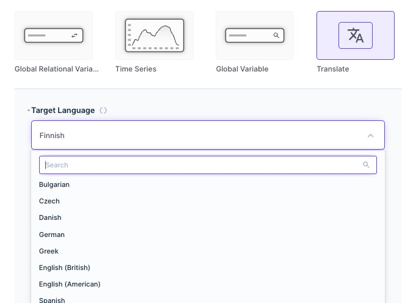
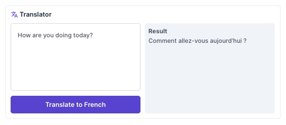

<!-- Please replace anything appearing between curly brackets with your submission's value.  -->

# DeepL Translator Panel

A panel that uses the [DeepL Free Translation API](https://www.deepl.com/docs-api) to translate detected language text into a specified target language.

## Details

This extension bundle is made up of an endpoint that uses the DeepL Translation API and a Panel which provides an interface to the endpoint. 

This can be provided as a convenience panel as part of a dashboard, or combined with other panels to create an internal CRM/Conversation tool. 

If given longer, I'd provide more options exposed by the API such as `formality` for languages like Japanese and German.

## Set Up Instructions

1. Sign up for a [DeepL Free Account](https://www.deepl.com/translator) and get an authentication key from your account settings.
2. Add a `DEEPL_KEY` environment variable to your Directus app.
3. Create a new folder in your extensions folder called `directus-extension-deepl`.
4. Add the content of this folder into the one you just created.
5. Launch Directus, add panel, and choose target language. 

## Screenshots

## Collaborators

- be7DOTis
